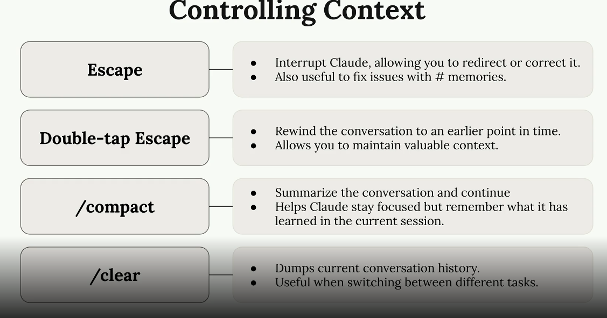

# UIGen

AI-powered React component generator with live preview.

## Prerequisites

- Node.js 18+
- npm

## Setup

1. **Optional** Edit `.env` and add your Anthropic API key:

```
ANTHROPIC_API_KEY=your-api-key-here
```

The project will run without an API key. Rather than using a LLM to generate components, static code will be returned instead.

2. Install dependencies and initialize database

```bash
npm run setup
```

This command will:

- Install all dependencies
- Generate Prisma client
- Run database migrations

## Running the Application

### Development

```bash
npm run dev
```

Open [http://localhost:3000](http://localhost:3000)

## Usage

1. Sign up or continue as anonymous user
2. Describe the React component you want to create in the chat
3. View generated components in real-time preview
4. Switch to Code view to see and edit the generated files
5. Continue iterating with the AI to refine your components

## Features

- AI-powered component generation using Claude
- Live preview with hot reload
- Virtual file system (no files written to disk)
- Syntax highlighting and code editor
- Component persistence for registered users
- Export generated code

## Tech Stack

- Next.js 15 with App Router
- React 19
- TypeScript
- Tailwind CSS v4
- Prisma with SQLite
- Anthropic Claude AI
- Vercel AI SDK

## Claude Learning Tips



### custom caommands:
The custom commands can be created using relevant instruction .md files ( for eg. .claude/commands/audit.md )
SO in this scenario, all the instructions are embedded within /audit command.

And whenever, this command is triggered, all the instructions will be followed.
These custom commands can have some argument declared inside their respective .md file. This arguement can be passed to custom command in the runtime ( for eg. /audit $arguement)

# Source Code - Queries
Steps to build a hook:


Some important info. from hooks:
https://anthropic.skilljar.com/claude-code-in-action/312427

